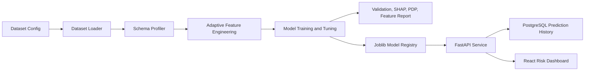

# Credit Risk Decision Platform

Production-style internal banking application for estimating applicant Probability of Default (PD), comparing candidate models, validating model performance, explaining drivers, and serving predictions through FastAPI and a React dashboard.

## Business Problem

Credit officers need a consistent way to estimate default risk, review model evidence, and preserve prediction history. This project is now structured as a reusable credit risk ML framework: dataset configuration selects the source and target, while schema profiling and feature engineering adapt automatically to the available variables.

## Architecture Diagram



## Folder Structure

```text
backend/credit_risk_platform/
  api/                  FastAPI endpoints
  config/               environment-driven settings
  database/             SQLAlchemy models and sessions
  evaluation/           validation metrics and explainability
  feature_engineering/  reusable preprocessing, WOE, interactions
  models/               model artifact registry
  services/             prediction business logic
  training/             dataset loading and model comparison
frontend/               React dashboard
tests/                  pytest coverage
docs/                   model validation notes
artifacts/              generated models, metrics, charts
```

## Supported Datasets

Dataset selection is configured in `backend/credit_risk_platform/config/datasets.py`.

Supported dataset keys:

- `german`: OpenML `credit-g` / UCI German Credit. Loaded automatically from OpenML.
- `give_me_some_credit`: Give Me Some Credit. Place `cs-training.csv` at `data/raw/give_me_some_credit/cs-training.csv`.
- `home_credit`: Home Credit Default Risk. Place `application_train.csv` at `data/raw/home_credit/application_train.csv`.

Each dataset config only specifies source location, target column, optional target mapping, optional ordinal mappings, and optional ignored columns. No synthetic or fabricated training data is used.

## Feature Engineering

The pipeline inspects the selected dataframe and automatically determines numeric, categorical, ordinal, boolean, and date columns. It then builds a model-ready preprocessing graph without hardcoding dataset-specific feature names.

Adaptive feature engineering creates features only when the source columns exist:

- Loan amount plus duration creates repayment-intensity features.
- Income plus loan amount creates debt-to-income ratio.
- Savings or assets plus loan amount creates savings-to-loan ratio.
- Age creates age bands and age squared.
- Employment duration creates an employment stability score.
- Existing loan counts plus loan amount create a credit exposure score.
- Revolving balance plus credit limit creates utilization.
- Delinquency or late-payment variables create delinquency counts and missed-payment ratios.
- Date columns create month, quarter, and age-in-days fields before raw date columns are dropped.

Ordinal encoding is used only for configured natural orderings or conservative inferred ordinal variables. Nominal variables use one-hot encoding. Numeric missing values use median imputation; categorical and boolean values use most-frequent imputation. Outlier clipping is selective and fitted only for heavy-tailed numeric variables. Logistic models receive scaled numeric features; tree models receive unscaled numeric features.

## Model Comparison

The training pipeline compares:

- Logistic Regression
- Ridge Logistic Regression
- Random Forest
- XGBoost

Each model is tuned with `RandomizedSearchCV`; no model is assumed to be best before training.

## Validation

Generated validation includes ROC AUC, PR AUC, KS statistic, Gini coefficient, precision, recall, F1, confusion matrix, calibration curve, lift chart, gain chart, threshold optimization, and cross-validation summaries. Actual results are written to `artifacts/metrics.json` only after models train.

## Explainability

The platform produces permutation importance, SHAP summary plots when SHAP is available, partial dependence plots for leading drivers, and a top-feature table for business review.

## API

Train the default German Credit model:

```bash
make install
make train
```

Train a specific supported dataset:

```bash
PYTHONPATH=backend python -m credit_risk_platform.training.train --dataset german
PYTHONPATH=backend python -m credit_risk_platform.training.train --dataset give_me_some_credit
PYTHONPATH=backend python -m credit_risk_platform.training.train --dataset home_credit
```

Run the API:

```bash
make api
```

Endpoints:

- `GET /health`
- `POST /predict`
- `POST /batch-predict`
- `POST /train`
- `GET /model-info`
- `GET /model-metrics`
- `GET /feature-importance`
- `GET /prediction-history`

## Database

Local production-like PostgreSQL:

```bash
docker compose up -d postgres
cp .env.example .env
```

`prediction_history` stores applicant features, PD, decision, model name, threshold, and timestamp. `model_versions` is available for model metadata. For fast local smoke tests, the default configuration uses SQLite unless `DATABASE_URL` is set.

## Dashboard

Run the React dashboard:

```bash
cd frontend
npm install
npm run dev
```

Pages include Dashboard, Single Prediction, Batch Prediction, Model Metrics, Feature Importance, and Prediction History.

## Feature Reports

Every training run generates:

- `artifacts/reports/<dataset>_feature_report.md`
- `artifacts/reports/<dataset>_feature_report.html`

The report includes original features, derived features, dropped features, missing value summary, categorical encoding summary, feature importance, and links to SHAP/PDP artifacts.

## Screenshots

Screenshots should be captured after running the API and dashboard locally. Generated model charts are saved under `artifacts/reports/`.

## Engineering

The repository uses type hints, structured logging, environment variables, pytest, Black, Ruff, GitHub Actions, SQLAlchemy, Joblib model persistence, FastAPI, and React/Vite.

## Future Improvements

- Add reject inference and population stability monitoring.
- Add model version promotion workflow with challenger/champion approvals.
- Add authentication and role-based dashboard access.
- Add production migrations with Alembic.
- Add fairness and adverse-action reason code reporting.
