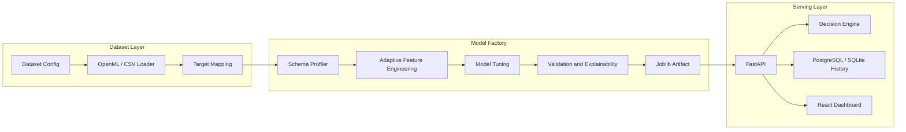
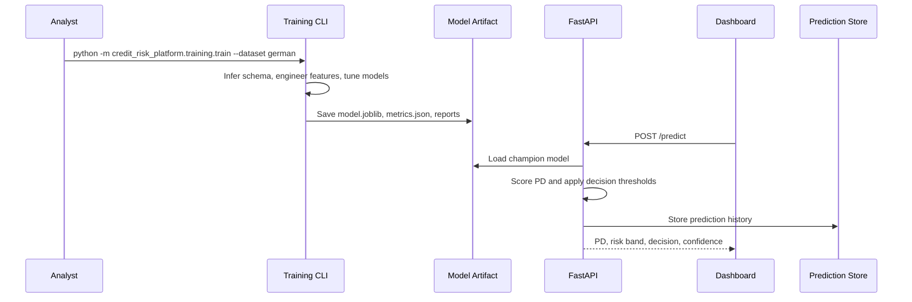
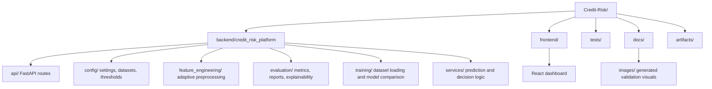
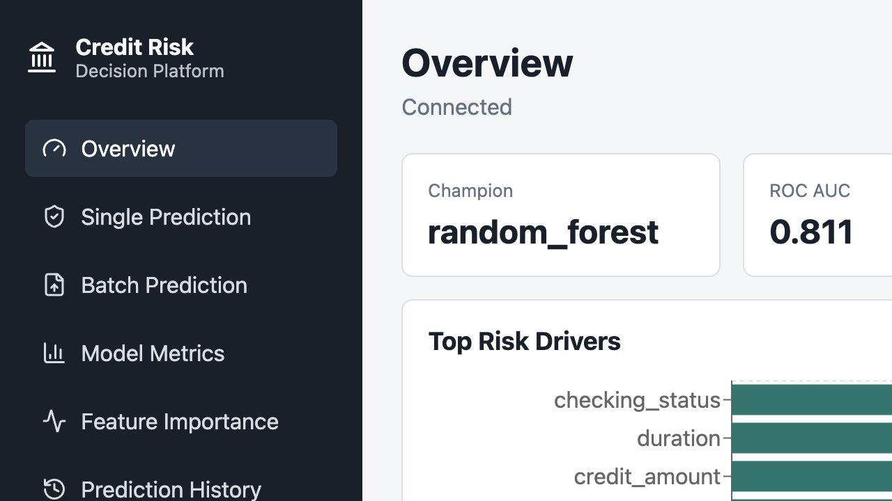
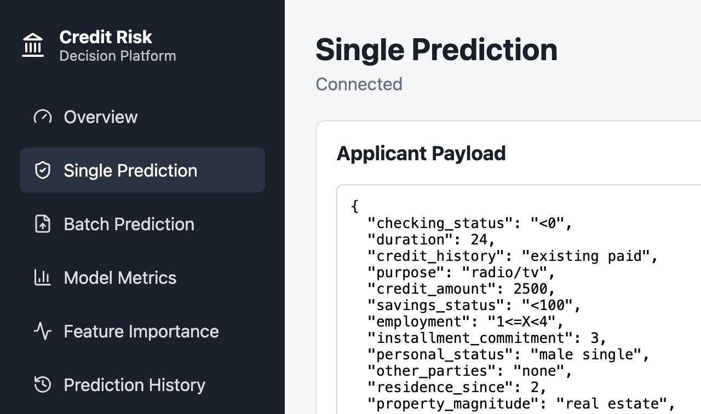
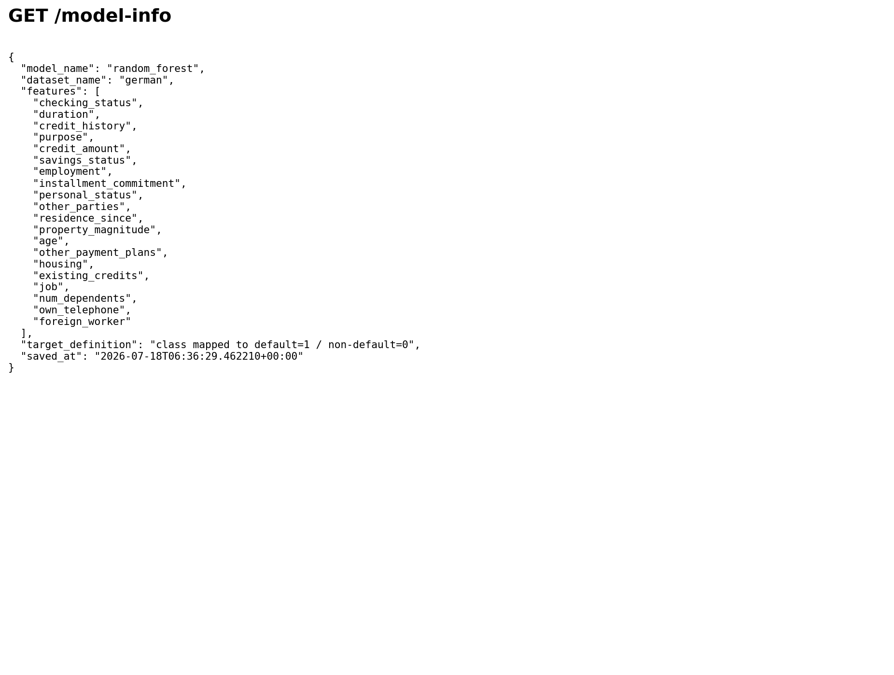

# Credit Risk Decision Platform

Production-style internal banking application for estimating applicant Probability of Default (PD), comparing challenger models, explaining risk drivers, recording prediction history, and supporting credit decision workflows through FastAPI and a React dashboard.

The repository is intentionally structured as an internal analytics platform rather than a notebook project. The current committed model artifact was trained on the public OpenML `credit-g` German Credit dataset; the framework also supports configurable loaders for Give Me Some Credit and Home Credit Default Risk when those public CSV files are placed in the configured local paths.

## Business Problem

Credit teams need a controlled way to score applications, inspect model evidence, apply business thresholds, and retain auditable prediction records. This platform separates dataset configuration, adaptive feature engineering, model validation, explainability, API serving, and dashboard presentation so that model risk reviewers can inspect the full decision path.

## Architecture



## Project Workflow



## Folder Structure



## Dashboard Screenshots

These screenshots are captured from the local React dashboard.





## API Screenshots

The following images are generated from live local API responses.




## Supported Datasets

Dataset selection is configured in [datasets.py](backend/credit_risk_platform/config/datasets.py).

| Key | Dataset | Source | Target |
| --- | --- | --- | --- |
| `german` | OpenML `credit-g` / UCI German Credit | OpenML | `class` |
| `give_me_some_credit` | Give Me Some Credit | `data/raw/give_me_some_credit/cs-training.csv` | `SeriousDlqin2yrs` |
| `home_credit` | Home Credit Default Risk | `data/raw/home_credit/application_train.csv` | `TARGET` |

Each dataset config specifies only source location, target column, optional target mapping, optional ordinal mappings, and optional ignored columns. The remaining feature engineering is inferred from the dataframe schema.

## Adaptive Feature Engineering

The pipeline detects numeric, categorical, ordinal, boolean, and date columns. It creates derived variables only when statistically meaningful source columns exist:

- Loan amount and duration produce repayment-intensity features.
- Income and loan amount produce debt-to-income ratio.
- Savings or assets and loan amount produce savings-to-loan ratio.
- Age produces age bands and age squared.
- Employment duration produces an employment stability score.
- Existing credit counts and loan amount produce credit exposure score.
- Revolving balance and credit limit produce utilization ratio.
- Delinquency and payment history variables produce delinquency counts and missed-payment ratios.
- Date variables produce month, quarter, and age-in-days features before raw date columns are dropped.

Ordinal encoding is used for configured natural orderings and conservative inferred ordinal variables. Nominal features use one-hot encoding. Logistic models receive scaled numeric features; tree models receive unscaled numeric features.

## Model Comparison Output

The current committed German Credit run selected `random_forest` as champion. These are actual generated metrics from `artifacts/metrics.json`.

| Model | ROC AUC | PR AUC | KS | Gini | F1 |
| --- | ---: | ---: | ---: | ---: | ---: |
| Logistic Regression | 0.769 | 0.567 | 0.431 | 0.537 | 0.593 |
| Ridge Logistic Regression | 0.768 | 0.572 | 0.429 | 0.535 | 0.596 |
| Random Forest | 0.811 | 0.711 | 0.469 | 0.623 | 0.631 |
| XGBoost | 0.800 | 0.683 | 0.457 | 0.600 | 0.618 |

## Validation Visuals

Generated visualizations are saved under `docs/images/`.


## Example SHAP Explanation

The SHAP summary below is generated from the trained champion model and transformed feature matrix.


## Example Prediction Request

```bash
curl -X POST http://localhost:8001/predict \
  -H "Content-Type: application/json" \
  -d '{
    "features": {
      "checking_status": "<0",
      "duration": 24,
      "credit_history": "existing paid",
      "purpose": "radio/tv",
      "credit_amount": 2500,
      "savings_status": "<100",
      "employment": "1<=X<4",
      "installment_commitment": 3,
      "personal_status": "male single",
      "other_parties": "none",
      "residence_since": 2,
      "property_magnitude": "real estate",
      "age": 35,
      "other_payment_plans": "none",
      "housing": "own",
      "existing_credits": 1,
      "job": "skilled",
      "num_dependents": 1,
      "own_telephone": "none",
      "foreign_worker": "yes"
    }
  }'
```

## Example Prediction Response

```json
{
  "probability_default": 0.5903049716870051,
  "decision": "Reject",
  "risk_band": "Very High",
  "prediction_confidence": 0.0403,
  "threshold": 0.4699999999999999,
  "model_name": "random_forest"
}
```

## Business Decision Engine

Decision thresholds are configured in [decision_thresholds.json](backend/credit_risk_platform/config/decision_thresholds.json). The API returns:

- Probability of Default
- Risk band
- Business decision: `Approve`, `Manual Review`, or `Reject`
- Prediction confidence

The threshold configuration is intentionally separate from the model artifact so credit policy can be reviewed independently from model estimation.

## Installation

```bash
git clone https://github.com/AgrmRana/Credit-Risk.git
cd Credit-Risk
make install
cd frontend
npm install
```

On macOS, XGBoost may require OpenMP:

```bash
brew install libomp
```

## Local Deployment

Start PostgreSQL when you want production-like persistence:

```bash
docker compose up -d postgres
cp .env.example .env
```

Train or refresh the model:

```bash
DATASET=german make train
```

Run the API. If another local service already uses port `8000`, use `8001`:

```bash
PYTHONPATH=backend uvicorn credit_risk_platform.api.main:app --host 0.0.0.0 --port 8001
```

Run the dashboard against that API:

```bash
cd frontend
VITE_API_BASE_URL=http://localhost:8001 npm run dev -- --host 0.0.0.0 --port 5173
```

Open:

- Dashboard: `http://localhost:5173`
- API docs: `http://localhost:8001/docs`
- Health check: `http://localhost:8001/health`

## API Endpoints

- `GET /health`
- `POST /predict`
- `POST /batch-predict`
- `POST /train?dataset=german`
- `POST /custom-datasets/upload` — upload an arbitrary CSV; returns a `dataset_id` and detected column types/sample values
- `POST /custom-datasets/{dataset_id}/train` — pick the target column (and, for non-0/1 labels, which value is the positive/default class) and retrain the model comparison pipeline on it. Binary classification only; replaces the currently deployed model, same as `/train`
- `GET /model-info`
- `GET /model-metrics`
- `GET /feature-importance`
- `GET /prediction-history`

## Testing and Quality

```bash
PYTHONPATH=backend pytest
PYTHONPATH=backend ruff check backend tests scripts
black --check backend tests scripts
cd frontend && npm run build
```

GitHub Actions runs pytest, Ruff, Black, and the frontend build.

## Governance

See [docs/model_governance.md](docs/model_governance.md) for model assumptions, limitations, potential bias, validation methodology, monitoring strategy, and retraining recommendations.

## Future Roadmap

- Add Alembic database migrations.
- Add authenticated analyst and reviewer roles.
- Add challenger/champion approval workflow.
- Add population stability index and drift monitors.
- Add adverse action reason-code reporting.
- Add fairness testing by protected-class proxies where legally and ethically appropriate.
- Add batch upload persistence with file-level audit metadata.
- Add model cards and release approval records for each promoted version.
