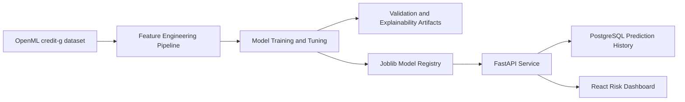

# Credit Risk Decision Platform

Production-style internal banking application for estimating applicant Probability of Default (PD), comparing candidate models, validating model performance, explaining drivers, and serving predictions through FastAPI and a React dashboard.

## Business Problem

Credit officers need a consistent way to estimate default risk, review model evidence, and preserve prediction history. This project trains PD models on the public OpenML `credit-g` German Credit dataset and records predictions with model metadata.

## Architecture Diagram



## Folder Structure

```text
backend/credit_risk_platform/
  api/                  FastAPI endpoints
  config/               environment-driven settings
  database/             SQLAlchemy models and sessions
  evaluation/           validation metrics and explainability
  feature_engineering/  reusable preprocessing, WOE, interactions
  models/               model artifact registry
  services/             prediction business logic
  training/             dataset loading and model comparison
frontend/               React dashboard
tests/                  pytest coverage
docs/                   model validation notes
artifacts/              generated models, metrics, charts
```

## Dataset

The project uses the well-known OpenML `credit-g` version of the UCI German Credit dataset. The original `class` target is mapped to `default=1` for bad credit risk and `default=0` for good credit risk. No synthetic or fabricated training data is used.

## Feature Engineering

Reusable modules support missing value handling, outlier clipping, ordinal encoding, one-hot encoding, scaling, feature interactions, and WOE encoding for scorecard-style experimentation.

## Model Comparison

The training pipeline compares:

- Logistic Regression
- Ridge Logistic Regression
- Random Forest
- XGBoost

Each model is tuned with `RandomizedSearchCV`; no model is assumed to be best before training.

## Validation

Generated validation includes ROC AUC, PR AUC, KS statistic, Gini coefficient, precision, recall, F1, confusion matrix, calibration curve, lift chart, gain chart, threshold optimization, and cross-validation summaries. Actual results are written to `artifacts/metrics.json` only after models train.

## Explainability

The platform produces permutation importance, SHAP summary plots when SHAP is available, partial dependence plots for leading drivers, and a top-feature table for business review.

## API

Run the API:

```bash
make install
make train
make api
```

Endpoints:

- `GET /health`
- `POST /predict`
- `POST /batch-predict`
- `POST /train`
- `GET /model-info`
- `GET /model-metrics`
- `GET /feature-importance`
- `GET /prediction-history`

## Database

Local production-like PostgreSQL:

```bash
docker compose up -d postgres
cp .env.example .env
```

`prediction_history` stores applicant features, PD, decision, model name, threshold, and timestamp. `model_versions` is available for model metadata. For fast local smoke tests, the default configuration uses SQLite unless `DATABASE_URL` is set.

## Dashboard

Run the React dashboard:

```bash
cd frontend
npm install
npm run dev
```

Pages include Dashboard, Single Prediction, Batch Prediction, Model Metrics, Feature Importance, and Prediction History.

## Screenshots

Screenshots should be captured after running the API and dashboard locally. Generated model charts are saved under `artifacts/reports/`.

## Engineering

The repository uses type hints, structured logging, environment variables, pytest, Black, Ruff, GitHub Actions, SQLAlchemy, Joblib model persistence, FastAPI, and React/Vite.

## Future Improvements

- Add reject inference and population stability monitoring.
- Add model version promotion workflow with challenger/champion approvals.
- Add authentication and role-based dashboard access.
- Add production migrations with Alembic.
- Add fairness and adverse-action reason code reporting.
