# Credit Risk Decision Platform

A local, on-demand tool for estimating applicant Probability of Default (PD): upload a CSV,
choose the target variable, and it runs adaptive feature engineering, compares four candidate
models, and shows validation metrics, explainability, and a business decision (Approve / Manual
Review / Reject) — all in one Streamlit page, entirely in memory.

This is closer to a local analysis tool (in the spirit of Weka, Orange, or RapidMiner) than a
deployed web service: there is no server to keep running, no database, and no account system.
Every run starts from a clean slate, and nothing is saved once you close the app.

## Business Problem

Credit teams need a fast way to score a new dataset, inspect model evidence, apply business
thresholds, and understand what's driving risk — without standing up infrastructure for a one-off
analysis. This tool separates dataset ingestion, adaptive feature engineering, model comparison,
validation/explainability, and decision-threshold logic, so the full decision path is inspectable
in one sitting.

## Architecture

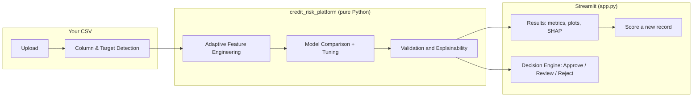

Everything in the `Engine` box runs against a temporary directory that is deleted the moment the
run finishes — nothing lands in the repo, and nothing carries over between runs.

## Folder Structure

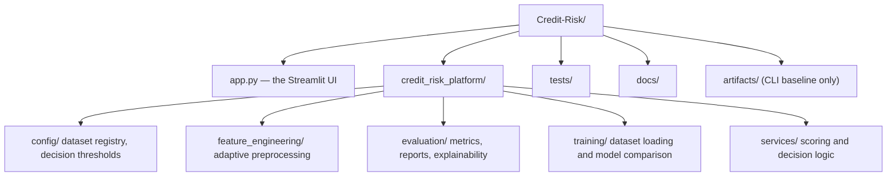

`credit_risk_platform/` is a plain analytical package — no web framework, no ORM, no database. It
has no idea it's being driven by a Streamlit app; `app.py` is the only thing that imports it for
interactive use.

## Running it

```bash
git clone https://github.com/AgrmRana/Credit-Risk.git
cd Credit-Risk
make install
make run
```

`make run` starts `streamlit run app.py`, which opens in your browser (usually
`http://localhost:8501`). Upload a CSV, pick the target column, click **Run Analysis**.

On macOS, XGBoost may require OpenMP:

```bash
brew install libomp
```

## What happens when you click "Run Analysis"

1. The uploaded CSV is profiled: columns are classified as numeric, categorical, ordinal, boolean,
   or date, and any column with between 2 and 20 unique values is offered as the target — binary
   or multi-class. For a binary target not already `0`/`1`, you're asked which value means the
   positive/default outcome; for 3+ classes, each value is automatically assigned a numeric code
   and the mapping is shown on screen.
2. You choose **k**, the number of cross-validation folds. The dataset is registered at runtime
   and run through the **same** training pipeline described below — four candidate models are
   tuned, then each is scored with k-fold cross validation using the out-of-fold predicted
   probabilities to compute a **test MSE** (the Brier score: mean squared error between predicted
   probability and actual outcome, generalized to multi-class as the sum of squared errors across
   all classes). The model with the lowest cross-validated test MSE becomes the champion. A
   progress bar and a dynamically updating "Trained X/4 candidate models — estimated time
   remaining: ~Ns" message track training as it happens, with the estimate recalculated after each
   model finishes based on the average time per model so far.
3. Results include a **leaderboard** ranking every candidate by cross-validated test MSE (with the
   winner highlighted) and the full metrics comparison table. For a binary target this also shows
   ROC/calibration curves and a lift/gain table; for multi-class it shows a confusion matrix
   heatmap labeled with the original class names instead (ROC/calibration/lift-gain don't have a
   standard multi-class form). SHAP summary, permutation feature importance, and the feature
   engineering report are shown for either case whenever they're generated successfully.
4. A **Score a Record** tab lets you fill in one new record's values and get a prediction from the
   model just trained — for binary targets, PD/risk band/business decision (Approve/Manual
   Review/Reject); for multi-class targets, the predicted class name and a probability bar chart
   across all classes. Still entirely in memory.
5. Clicking **Start Over** (or just closing the app) discards everything. Nothing is written to
   the repo.

## How the Target Column Is Interpreted

The app never inspects your data's meaning — only its shape (how many distinct values a column
has). That leads to one assumption worth knowing about, and two behaviors that are already handled
correctly:

- **If your target column is already exactly `0`/`1`, the app assumes `1 = default` and
  `0 = non-default` without asking.** It only shows the "which value represents the positive /
  default outcome?" picker when the two values are something *other* than `0`/`1` (e.g.
  `"good"`/`"bad"`). If your data encodes it the other way around (`1 = repaid`, `0 = defaulted` —
  a real convention some datasets use), predictions, risk bands, and Approve/Reject decisions will
  come out inverted, with no warning. If you're not sure which way your data is encoded, safest is
  to check it yourself before uploading, or re-map it so `1` clearly means the bad/default outcome.
- **A "Potential Target Variables" table lists every column that could be a target — before you
  pick one.** For each candidate it shows the column name, how many classes it has, and its
  encoding: `already 0/1 (assumes 1 = positive/default outcome)` for already-binary columns, the
  two raw values for a 2-class column you haven't assigned yet, or the full class → code mapping
  for any 3+ class column. This is a preview of every candidate at once, not just the one currently
  selected in the dropdown below it.
- **For a 2-class target that isn't already exactly `0`/`1`, nothing is assumed — you must decide
  which value is positive and which is negative.** Once selected, the app shows a "which value
  represents the positive / default outcome?" picker with the two raw values as options; whichever
  one you pick is mapped to `1`, the other to `0`. This applies equally whether the two values are
  qualitative (`"good"`/`"bad"`) or **numerical but not `0`/`1`** — e.g. a column containing only
  `1` and `2`, or only `5` and `10`. The app makes no assumption about which number is "better" or
  "worse"; it treats any two-value pair the same way unless the values are *literally* the strings
  `"0"` and `"1"`, and always asks. (One related gotcha: a column of floats `0.0`/`1.0` is **not**
  treated as "already 0/1" either — the picker still appears — because the check compares string
  representations, and `str(0.0)` is `"0.0"`, not `"0"`.) For any 3+ class target, nothing is
  assumed either: the app confirms the same class → code mapping again before training.
- **Score a Record always displays the original values, never the internal numeric codes** — this
  applies whether those original values are qualitative (`"high"`, `"medium"`, `"low"`) or
  themselves numeric (e.g. a `risk_score` column with values `1`–`5`). Internally every target is
  mapped to sequential codes `0..N-1` so the models can be fit, but the predicted-class label, the
  probability bar chart's category labels, and the multi-class confusion matrix's axis labels all
  map back through to whatever value was actually in your CSV.

## Adaptive Feature Engineering

The pipeline detects numeric, categorical, ordinal, boolean, and date columns, and creates derived
variables only when statistically meaningful source columns exist:

- Loan amount and duration produce repayment-intensity features.
- Income and loan amount produce debt-to-income ratio.
- Savings or assets and loan amount produce savings-to-loan ratio.
- Age produces age bands and age squared.
- Employment duration produces an employment stability score.
- Existing credit counts and loan amount produce credit exposure score.
- Revolving balance and credit limit produce utilization ratio.
- Delinquency and payment history variables produce delinquency counts and missed-payment ratios.
- Date variables produce month, quarter, and age-in-days features before raw date columns are dropped.

Ordinal encoding is used for configured natural orderings and conservative inferred ordinal
variables. Nominal features use one-hot encoding. Logistic models receive scaled numeric features;
tree models receive unscaled numeric features.

## Business Decision Engine

Decision thresholds live in
[decision_thresholds.json](credit_risk_platform/config/decision_thresholds.json), separate from
any trained model, so credit policy can be reviewed independently of model estimation. Every score
comes back with:

- Probability of Default
- Risk band
- Business decision: `Approve`, `Manual Review`, or `Reject`
- Prediction confidence

## Reproducing the committed baseline (optional CLI)

The repo ships with a pre-trained baseline (`artifacts/`) on the public OpenML `credit-g` German
Credit dataset, used for the metrics/plots below and in `docs/images/`. This is regenerated with a
plain CLI command — a separate, optional path from the interactive app, kept because it's how the
committed baseline and documentation images get reproduced, not because the app needs it:

```bash
DATASET=german make train
```

The framework also supports configurable CSV loaders for Give Me Some Credit and Home Credit
Default Risk (see [datasets.py](credit_risk_platform/config/datasets.py)) when those public files
are placed in the configured local paths — useful for the CLI, not required for the interactive
upload flow, which accepts any CSV directly.

| Key | Dataset | Source | Target |
| --- | --- | --- | --- |
| `german` | OpenML `credit-g` / UCI German Credit | OpenML | `class` |
| `give_me_some_credit` | Give Me Some Credit | `data/raw/give_me_some_credit/cs-training.csv` | `SeriousDlqin2yrs` |
| `home_credit` | Home Credit Default Risk | `data/raw/home_credit/application_train.csv` | `TARGET` |

### Baseline model comparison

These are the actual metrics from the committed `artifacts/metrics.json` (German Credit, champion:
`random_forest`, selected by cross-validated ROC AUC). F1 is measured at the operating threshold
learned on the training folds (see "Methodology and Statistical Soundness" below), not a
test-set-optimal cutoff:

| Model | ROC AUC | PR AUC | KS | Gini | F1 |
| --- | ---: | ---: | ---: | ---: | ---: |
| Logistic Regression | 0.769 | 0.567 | 0.431 | 0.537 | 0.571 |
| Ridge Logistic Regression | 0.768 | 0.572 | 0.429 | 0.535 | 0.570 |
| Random Forest | 0.811 | 0.711 | 0.469 | 0.623 | 0.605 |
| XGBoost | 0.800 | 0.683 | 0.457 | 0.600 | 0.575 |

### Validation visuals

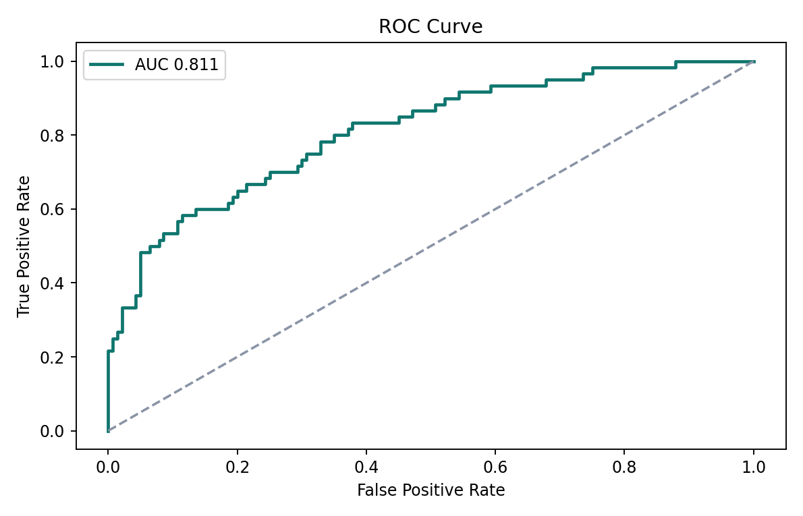
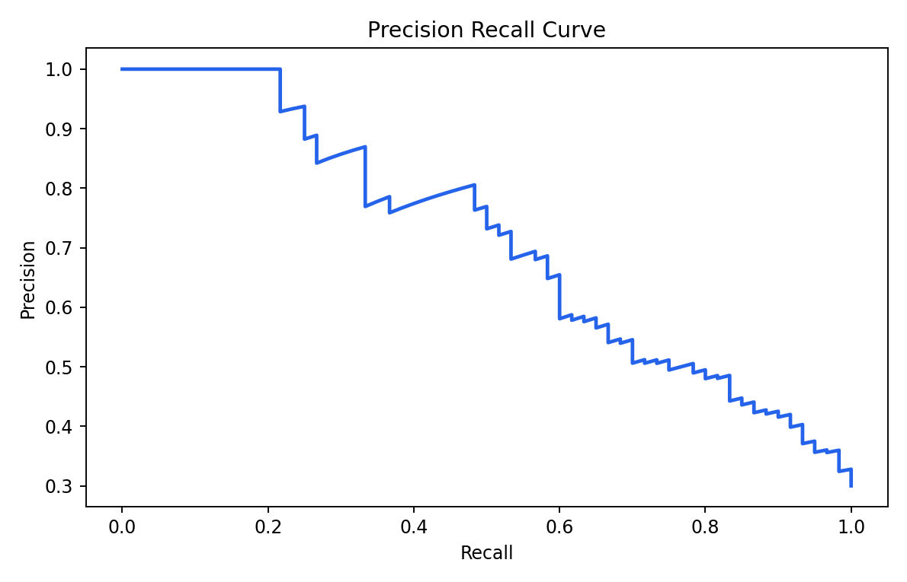
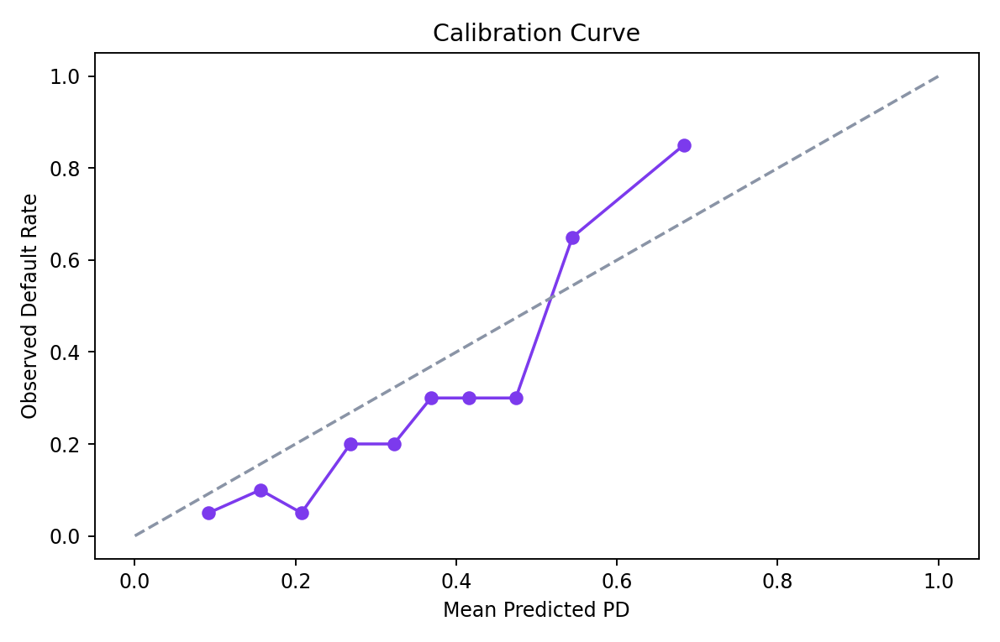
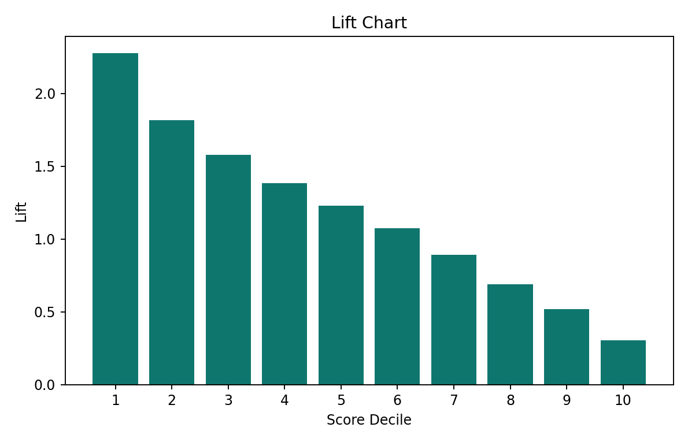
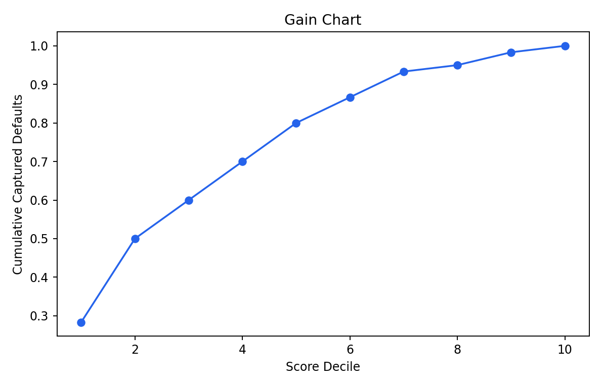
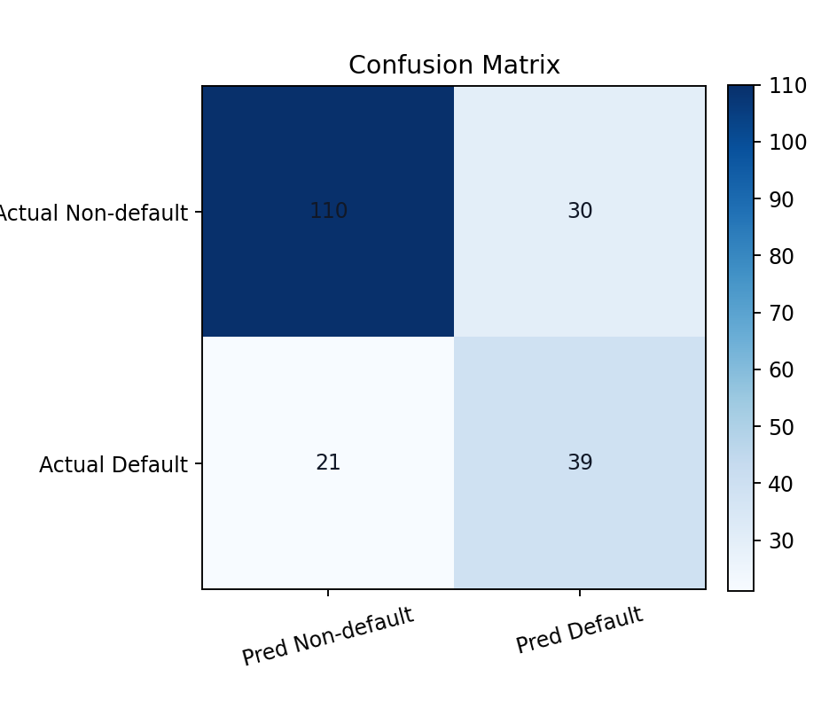
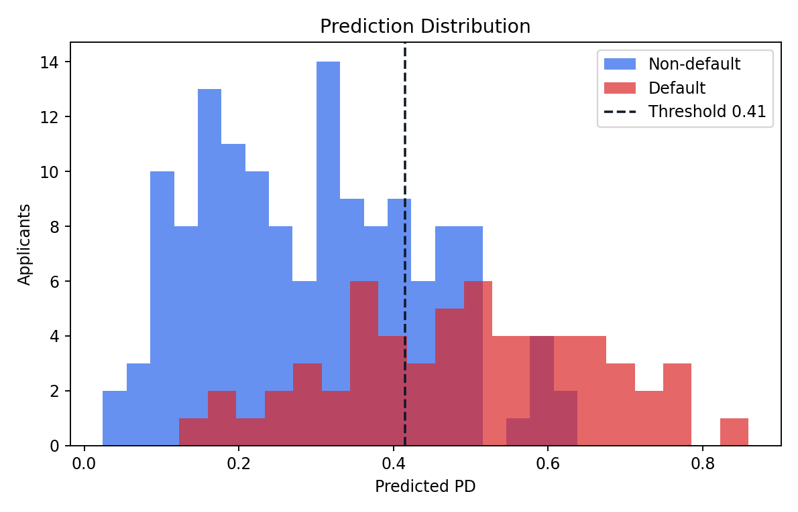
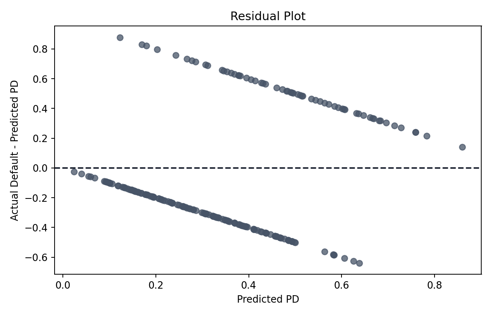
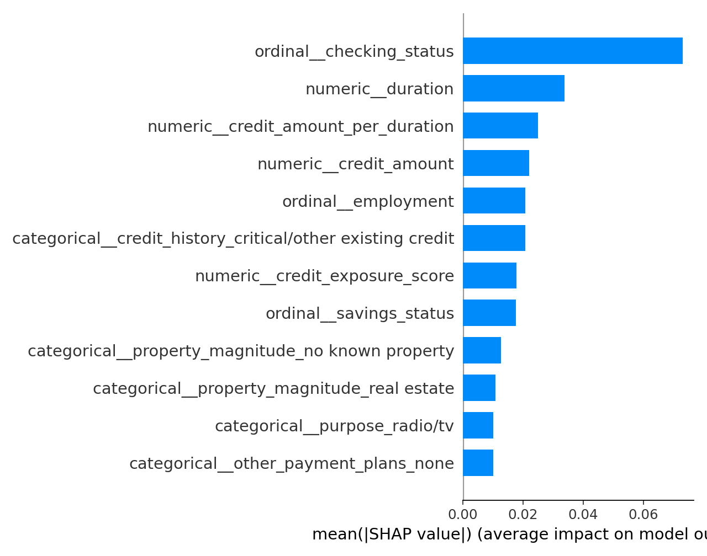

## Methodology and Statistical Soundness

The pipeline is built to keep the held-out test set a genuinely clean estimate of generalisation.
The key safeguards:

- **All preprocessing is fit inside cross-validation.** Feature engineering, median imputation,
  outlier clipping (train-quantile bounds), scaling, and one-hot/ordinal encoding live in a single
  sklearn `Pipeline` that is the estimator passed to `RandomizedSearchCV`, so every transform is
  re-fit on each fold's training portion only — no statistic ever leaks from a validation fold or
  the test set into fitting. No engineered feature uses the target, so there is no target leakage.
- **The champion is selected on a cross-validated (train-only) metric, never the test set.**
  Selection uses `cv_roc_auc_mean` (CLI default) or `cv_test_mse` (the app), both computed by
  k-fold cross validation on the training data. The test set is scored *once*, for reporting, after
  the champion is fixed — so the reported test metrics are not biased by model selection. (Earlier
  the CLI default selected on test-set ROC AUC, which contaminated the held-out estimate; that is
  fixed.)
- **The decision threshold is learned on training data, not the test set.** The operating cutoff
  used for precision/recall/F1/confusion-matrix (and stored for serving) is optimised on the
  out-of-fold *training* predictions, then applied to the test set. (Earlier the cutoff was
  optimised directly on the test set and reported at that same optimum, which inflated those
  threshold-dependent metrics; that is fixed. ROC AUC, PR AUC, KS, and Gini are threshold-free and
  were unaffected either way.)
- **Metric formulas** are standard: Gini `= 2·AUC − 1`, KS `= max(TPR − FPR)` over the ROC curve,
  PR AUC via average precision, and the cross-validated "test MSE" is the Brier score
  (`mean((y − p)²)` for binary, the multi-class sum-of-squared-errors Brier for 3+ classes).

### Known limitations (honest, not defects)

These are inherent trade-offs, documented rather than hidden:

- **Single train/test split.** The test metrics are one 80/20 point estimate with no confidence
  interval; on a small dataset (German Credit is 1,000 rows) they carry real variance. Repeated
  splits or a nested-CV outer loop would quantify that.
- **Non-nested CV for the reported CV scores.** Hyperparameter search and the `cv_*` scores reuse
  the same folds, so those CV numbers are *mildly optimistic* as generalisation estimates. They are
  still valid for *choosing between* candidates (the bias is roughly uniform across models), and
  the untouched test set remains the honest headline estimate.
- **Predicted probabilities may be imperfectly calibrated.** Tree ensembles (RF/XGBoost) don't
  guarantee calibrated `predict_proba`; the calibration curve is shown so you can judge this, but
  no post-hoc calibration (e.g. isotonic/Platt) is applied.
- **Class imbalance handling is asymmetric.** Logistic and random-forest tune `class_weight`, but
  XGBoost does not tune `scale_pos_weight`, so imbalance is handled slightly differently per model.
- **Ratio features clamp the denominator to a minimum of 1** to avoid divide-by-zero, which can
  distort ratios whose natural denominator is a small fraction.
- The already-`0`/`1` **target direction is assumed** (`1 = default`); see "How the Target Column
  Is Interpreted".

## Testing and Quality

```bash
pytest
ruff check credit_risk_platform tests scripts app.py
black --check credit_risk_platform tests scripts app.py
```

GitHub Actions runs pytest, Ruff, and Black on every push.

## Governance

See [docs/model_governance.md](docs/model_governance.md) for model assumptions, limitations,
potential bias, validation methodology, monitoring strategy, and retraining recommendations.

## Future Roadmap

- Add population stability index and drift monitors for a re-uploaded dataset.
- Add adverse action reason-code reporting alongside each decision.
- Add fairness testing by protected-class proxies where legally and ethically appropriate.
- Support regression targets, not just binary/multi-class classification.
- Let the user override auto-detected column types before training.
- Ask which value means "default" even when a binary target is already `0`/`1`, instead of
  assuming `1 = default` (see "How the Target Column Is Interpreted" above).
