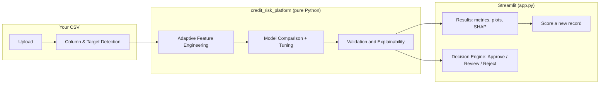
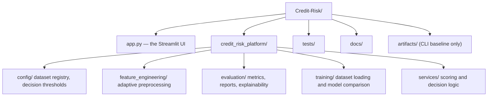

# Credit Risk Decision Platform

A local, on-demand tool for estimating applicant Probability of Default (PD): upload a CSV,
choose the target variable, and it runs adaptive feature engineering, compares four candidate
models, and shows validation metrics, explainability, and a business decision (Approve / Manual
Review / Reject) — all in one Streamlit page, entirely in memory.

This is closer to a local analysis tool (in the spirit of Weka, Orange, or RapidMiner) than a
deployed web service: there is no server to keep running, no database, and no account system.
Every run starts from a clean slate, and nothing is saved once you close the app.

## Business Problem

Credit teams need a fast way to score a new dataset, inspect model evidence, apply business
thresholds, and understand what's driving risk — without standing up infrastructure for a one-off
analysis. This tool separates dataset ingestion, adaptive feature engineering, model comparison,
validation/explainability, and decision-threshold logic, so the full decision path is inspectable
in one sitting.

## Architecture



Everything in the `Engine` box runs against a temporary directory that is deleted the moment the
run finishes — nothing lands in the repo, and nothing carries over between runs.

## Folder Structure



`credit_risk_platform/` is a plain analytical package — no web framework, no ORM, no database. It
has no idea it's being driven by a Streamlit app; `app.py` is the only thing that imports it for
interactive use.

## Running it

```bash
git clone https://github.com/AgrmRana/Credit-Risk.git
cd Credit-Risk
make install
make run
```

`make run` starts `streamlit run app.py`, which opens in your browser (usually
`http://localhost:8501`). Upload a CSV, pick the target column, click **Run Analysis**.

On macOS, XGBoost may require OpenMP:

```bash
brew install libomp
```

## What happens when you click "Run Analysis"

1. The uploaded CSV is profiled: columns are classified as numeric, categorical, ordinal, boolean,
   or date, and only columns with exactly two unique values are offered as the target (the engine
   is binary-classification only). If the target isn't already `0`/`1`, you're asked which value
   means the positive/default outcome.
2. The dataset is registered at runtime and run through the **same** training pipeline described
   below — four candidate models are tuned and compared, and the best one by ROC AUC becomes the
   champion for that run.
3. Results (model comparison table, ROC/calibration curves, lift/gain, SHAP summary, feature
   engineering report) are displayed directly in the browser.
4. A **Score a Record** tab lets you fill in one new record's values and get its PD, risk band,
   and business decision from the model just trained — still entirely in memory.
5. Clicking **Start Over** (or just closing the app) discards everything. Nothing is written to
   the repo.

## Adaptive Feature Engineering

The pipeline detects numeric, categorical, ordinal, boolean, and date columns, and creates derived
variables only when statistically meaningful source columns exist:

- Loan amount and duration produce repayment-intensity features.
- Income and loan amount produce debt-to-income ratio.
- Savings or assets and loan amount produce savings-to-loan ratio.
- Age produces age bands and age squared.
- Employment duration produces an employment stability score.
- Existing credit counts and loan amount produce credit exposure score.
- Revolving balance and credit limit produce utilization ratio.
- Delinquency and payment history variables produce delinquency counts and missed-payment ratios.
- Date variables produce month, quarter, and age-in-days features before raw date columns are dropped.

Ordinal encoding is used for configured natural orderings and conservative inferred ordinal
variables. Nominal features use one-hot encoding. Logistic models receive scaled numeric features;
tree models receive unscaled numeric features.

## Business Decision Engine

Decision thresholds live in
[decision_thresholds.json](credit_risk_platform/config/decision_thresholds.json), separate from
any trained model, so credit policy can be reviewed independently of model estimation. Every score
comes back with:

- Probability of Default
- Risk band
- Business decision: `Approve`, `Manual Review`, or `Reject`
- Prediction confidence

## Reproducing the committed baseline (optional CLI)

The repo ships with a pre-trained baseline (`artifacts/`) on the public OpenML `credit-g` German
Credit dataset, used for the metrics/plots below and in `docs/images/`. This is regenerated with a
plain CLI command — a separate, optional path from the interactive app, kept because it's how the
committed baseline and documentation images get reproduced, not because the app needs it:

```bash
DATASET=german make train
```

The framework also supports configurable CSV loaders for Give Me Some Credit and Home Credit
Default Risk (see [datasets.py](credit_risk_platform/config/datasets.py)) when those public files
are placed in the configured local paths — useful for the CLI, not required for the interactive
upload flow, which accepts any CSV directly.

| Key | Dataset | Source | Target |
| --- | --- | --- | --- |
| `german` | OpenML `credit-g` / UCI German Credit | OpenML | `class` |
| `give_me_some_credit` | Give Me Some Credit | `data/raw/give_me_some_credit/cs-training.csv` | `SeriousDlqin2yrs` |
| `home_credit` | Home Credit Default Risk | `data/raw/home_credit/application_train.csv` | `TARGET` |

### Baseline model comparison

These are the actual metrics from the committed `artifacts/metrics.json` (German Credit, champion:
`random_forest`):

| Model | ROC AUC | PR AUC | KS | Gini | F1 |
| --- | ---: | ---: | ---: | ---: | ---: |
| Logistic Regression | 0.769 | 0.567 | 0.431 | 0.537 | 0.593 |
| Ridge Logistic Regression | 0.768 | 0.572 | 0.429 | 0.535 | 0.596 |
| Random Forest | 0.811 | 0.711 | 0.469 | 0.623 | 0.631 |
| XGBoost | 0.800 | 0.683 | 0.457 | 0.600 | 0.618 |

### Validation visuals


## Testing and Quality

```bash
pytest
ruff check credit_risk_platform tests scripts app.py
black --check credit_risk_platform tests scripts app.py
```

GitHub Actions runs pytest, Ruff, and Black on every push.

## Governance

See [docs/model_governance.md](docs/model_governance.md) for model assumptions, limitations,
potential bias, validation methodology, monitoring strategy, and retraining recommendations.

## Future Roadmap

- Add population stability index and drift monitors for a re-uploaded dataset.
- Add adverse action reason-code reporting alongside each decision.
- Add fairness testing by protected-class proxies where legally and ethically appropriate.
- Support multi-class and regression targets, not just binary classification.
- Let the user override auto-detected column types before training.
