# Credit Risk Decision Platform

A local tool for estimating an applicant's Probability of Default (PD). Upload a CSV, pick a
target column, and it handles the rest: adaptive feature engineering, a comparison across four
candidate models, validation metrics, explainability, and a final business decision (Approve /
Manual Review / Reject). All of it runs in one Streamlit page, entirely in memory.

I built this closer to a desktop analysis tool — think Weka, Orange, RapidMiner — than a deployed
web service. There's no server to babysit, no database, no accounts. Every run starts clean, and
closing the app throws everything away.

## Business Problem

Credit teams need a fast way to take a new dataset, get model evidence, apply business
thresholds, and understand what's actually driving risk, without spinning up infrastructure for
what is usually a one-off analysis. I split the work into distinct stages — ingestion, feature
engineering, model comparison, validation/explainability, and decision logic — so the whole path
from raw data to a lending decision is inspectable in one sitting rather than buried in a notebook.

## Architecture

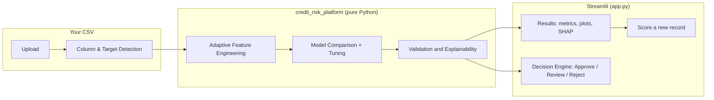
```mermaid
flowchart LR
    subgraph Input["Your CSV"]
        A["Upload"] --> B["Column & Target Detection"]
    end
    subgraph Engine["credit_risk_platform (pure Python)"]
        B --> C["Adaptive Feature Engineering"]
        C --> D["Model Comparison + Tuning"]
        D --> E["Validation and Explainability"]
    end
    subgraph UI["Streamlit (app.py)"]
        E --> F["Results: metrics, plots, SHAP"]
        E --> G["Decision Engine: Approve / Review / Reject"]
        F --> H["Score a new record"]
    end
```

Everything inside the `Engine` box writes to a temporary directory that's deleted the second the
run finishes. Nothing lands in the repo, and nothing carries over between runs.

## Folder Structure

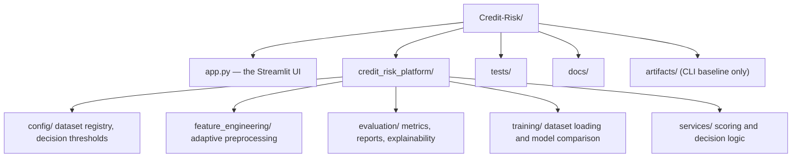
```mermaid
flowchart TD
    R["Credit-Risk/"] --> APP["app.py — the Streamlit UI"]
    R --> P["credit_risk_platform/"]
    R --> T["tests/"]
    R --> D["docs/"]
    R --> A["artifacts/ (CLI baseline only)"]
    P --> CFG["config/ dataset registry, decision thresholds"]
    P --> FE["feature_engineering/ adaptive preprocessing"]
    P --> EV["evaluation/ metrics, reports, explainability"]
    P --> TR["training/ dataset loading and model comparison"]
    P --> SVC["services/ scoring and decision logic"]
```

`credit_risk_platform/` is a plain analytical package: no web framework, no ORM, no database
inside it. It has no idea a Streamlit app is driving it — `app.py` is the only thing that imports
it for interactive use, and the CLI trainer is the only other consumer.

## Running it

```bash
git clone https://github.com/AgrmRana/Credit-Risk.git
cd Credit-Risk
make install
make run
```

`make run` starts `streamlit run app.py` and opens it in your browser (usually
`http://localhost:8501`). Upload a CSV, pick the target column, click **Run Analysis**.

On macOS, XGBoost needs OpenMP, which isn't bundled by default:

```bash
brew install libomp
```

## What happens when you click "Run Analysis"

1. The CSV gets profiled — every column is classified as numeric, categorical, ordinal, boolean,
   or date, and anything with between 2 and 20 unique values is offered up as a possible target,
   whether that's a binary outcome or something with more classes. If a binary column isn't
   already `0`/`1`, I ask which value counts as the positive/default outcome. For three or more
   classes, each value gets a numeric code automatically and the mapping is shown right on screen.
2. You pick **k**, the number of cross-validation folds. The dataset gets registered at runtime
   and pushed through the same training pipeline described below: four candidate models get
   tuned, then each is scored with k-fold cross validation using out-of-fold predicted
   probabilities to compute a **test MSE** — the Brier score, essentially mean squared error
   between predicted probability and actual outcome (generalized to multi-class as a sum of
   squared errors across classes). Whichever model has the lowest cross-validated test MSE
   becomes the champion. While training runs, a progress bar and a status line ("Trained X/4
   candidate models — estimated time remaining: ~Ns") update live, with the estimate recalculated
   after every model finishes.
3. Results come back as a **leaderboard** ranking every candidate by cross-validated test MSE
   (winner highlighted) plus the full metrics table. For a binary target you also get ROC and
   calibration curves and a lift/gain table; for multi-class targets, a confusion matrix heatmap
   takes their place instead, since ROC/calibration/lift-gain don't really generalize past two
   classes. SHAP summary, permutation feature importance, and the feature engineering report show
   up for either case whenever they generate successfully.
4. The **Score a Record** tab lets you fill in one new applicant's values and get a live
   prediction from the model you just trained — PD, risk band, and an Approve/Manual
   Review/Reject decision for binary targets, or the predicted class plus a probability bar chart
   for multi-class. Still entirely in memory.
5. Hit **Start Over**, or just close the app, and everything's gone. Nothing gets written to the
   repo.

## How the Target Column Is Interpreted

The app doesn't try to understand what your data means — only its shape, i.e. how many distinct
values a column takes. That leads to one assumption you should know about, and a couple of things
I made sure were handled properly.

- **If your target column is already exactly `0`/`1`, I assume `1 = default` and `0 =
  non-default` without asking.** The "which value is positive?" picker only shows up when the two
  values are something other than `0`/`1` (say, `"good"`/`"bad"`). If your data happens to be
  coded the other way — `1 = repaid`, `0 = defaulted`, which some datasets genuinely do — every
  prediction, risk band, and Approve/Reject call comes out backwards, with no warning from the
  app. If you're not sure how your column is coded, check it yourself before uploading, or remap
  it so `1` clearly means the bad outcome.
- **There's a "Potential Target Variables" table that shows every column that could be a target,
  before you even pick one.** For each candidate it lists the column name, how many classes it
  has, and how it would be encoded: `already 0/1 (assumes 1 = positive/default outcome)`, the two
  raw values waiting on your pick, or the full class-to-code mapping for anything with 3+ classes.
  It's a preview of every option at once, not just whatever happens to be selected in the dropdown
  below it.
- **For a two-value target that isn't already `0`/`1`, nothing gets assumed** — you decide which
  value is positive and which is negative. Once you pick, whichever value you chose maps to `1`
  and the other to `0`. This works the same way whether the two values are qualitative
  (`"good"`/`"bad"`) or **numeric but not `0`/`1`** — a column that's only `1` and `2`, say, or
  only `5` and `10`. There's no assumption baked in about which number is "better." Any two-value
  column gets the same treatment unless its values are literally the strings `"0"` and `"1"`, in
  which case it always asks. One gotcha worth knowing: a column of floats `0.0`/`1.0` does **not**
  count as "already 0/1" — the picker still appears, because the check compares string
  representations and `str(0.0)` is `"0.0"`, not `"0"`. For 3+ classes, same idea: nothing's
  assumed, and the app just confirms the class-to-code mapping again before training starts.
- **Score a Record always shows you the original values, never the internal numeric codes** —
  whether those original values are qualitative (`"high"`, `"medium"`, `"low"`) or numeric
  themselves, like a `risk_score` column running `1`–`5`. Internally, every target gets mapped to
  sequential codes `0..N-1` so the models can actually be fit, but the predicted-class label, the
  probability bar chart's labels, and the multi-class confusion matrix's axis labels all map back
  to whatever was actually sitting in your CSV.

## Adaptive Feature Engineering

The pipeline detects numeric, categorical, ordinal, boolean, and date columns, and only builds
derived features when the underlying columns that make them meaningful actually exist:

- Loan amount and duration produce repayment-intensity features.
- Income and loan amount produce a debt-to-income ratio.
- Savings or assets and loan amount produce a savings-to-loan ratio.
- Age produces age bands and an age-squared term.
- Employment duration produces an employment stability score.
- Existing credit counts and loan amount produce a credit exposure score.
- Revolving balance and credit limit produce a utilization ratio.
- Delinquency and payment history produce delinquency counts and missed-payment ratios.
- Date columns produce month, quarter, and age-in-days features, and the raw date is dropped
  afterward.

Ordinal encoding gets used for configured natural orderings and for cautiously inferred ordinal
variables. Nominal features get one-hot encoded. Logistic models get scaled numeric features; tree
models get them unscaled, since scaling doesn't change how a tree splits anyway.

## Business Decision Engine

Decision thresholds live in a separate
[decision_thresholds.json](credit_risk_platform/config/decision_thresholds.json), deliberately
kept apart from any trained model so credit policy can be reviewed on its own, without touching
the modeling side. Every score comes back with:

- Probability of Default
- Risk band
- Business decision: `Approve`, `Manual Review`, or `Reject`
- Prediction confidence

## Reproducing the committed baseline (optional CLI)

The repo ships with a pre-trained baseline (`artifacts/`) on the public OpenML `credit-g` German
Credit dataset — that's what produced the metrics and plots below and in `docs/images/`. You can
regenerate it with a plain CLI command. It's a separate, optional path from the interactive app,
kept around specifically so the committed baseline and documentation images stay reproducible, not
because the app needs it:

```bash
DATASET=german make train
```

The framework also supports configurable CSV loaders for Give Me Some Credit and Home Credit
Default Risk (see [datasets.py](credit_risk_platform/config/datasets.py)) if those public files
are placed in the configured local paths. That's useful for the CLI specifically — the interactive
upload flow accepts any CSV directly and doesn't need it.

| Key | Dataset | Source | Target |
| --- | --- | --- | --- |
| `german` | OpenML `credit-g` / UCI German Credit | OpenML | `class` |
| `give_me_some_credit` | Give Me Some Credit | `data/raw/give_me_some_credit/cs-training.csv` | `SeriousDlqin2yrs` |
| `home_credit` | Home Credit Default Risk | `data/raw/home_credit/application_train.csv` | `TARGET` |

### Baseline model comparison

These numbers come straight from the committed `artifacts/metrics.json` (German Credit, champion:
`random_forest`, selected by cross-validated ROC AUC). F1 is measured at the operating threshold
learned on the training folds — see "Methodology and Statistical Soundness" below for why that
matters — not a threshold picked to look good on the test set:

| Model | ROC AUC | PR AUC | KS | Gini | F1 |
| --- | ---: | ---: | ---: | ---: | ---: |
| Logistic Regression | 0.769 | 0.567 | 0.431 | 0.537 | 0.571 |
| Ridge Logistic Regression | 0.768 | 0.572 | 0.429 | 0.535 | 0.570 |
| Random Forest | 0.811 | 0.711 | 0.469 | 0.623 | 0.605 |
| XGBoost | 0.800 | 0.683 | 0.457 | 0.600 | 0.575 |

### Validation visuals

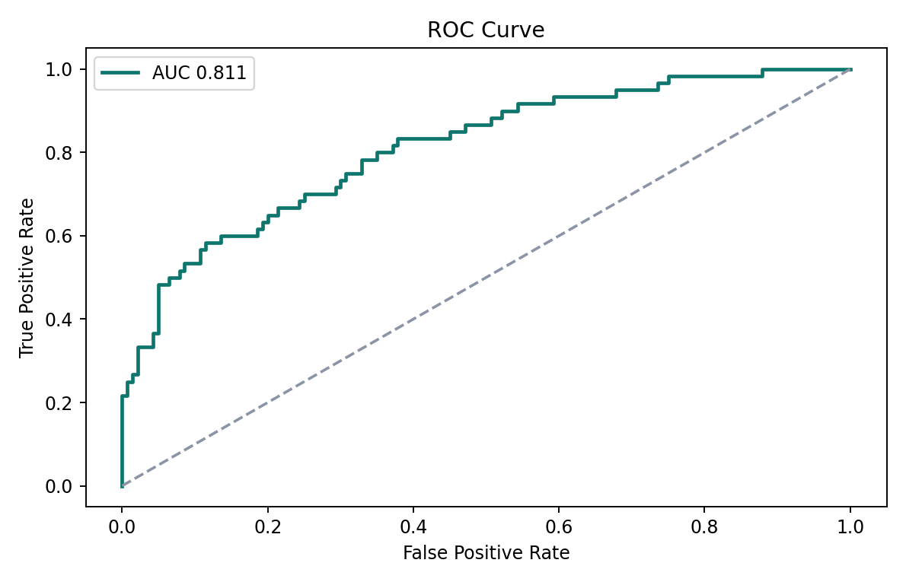
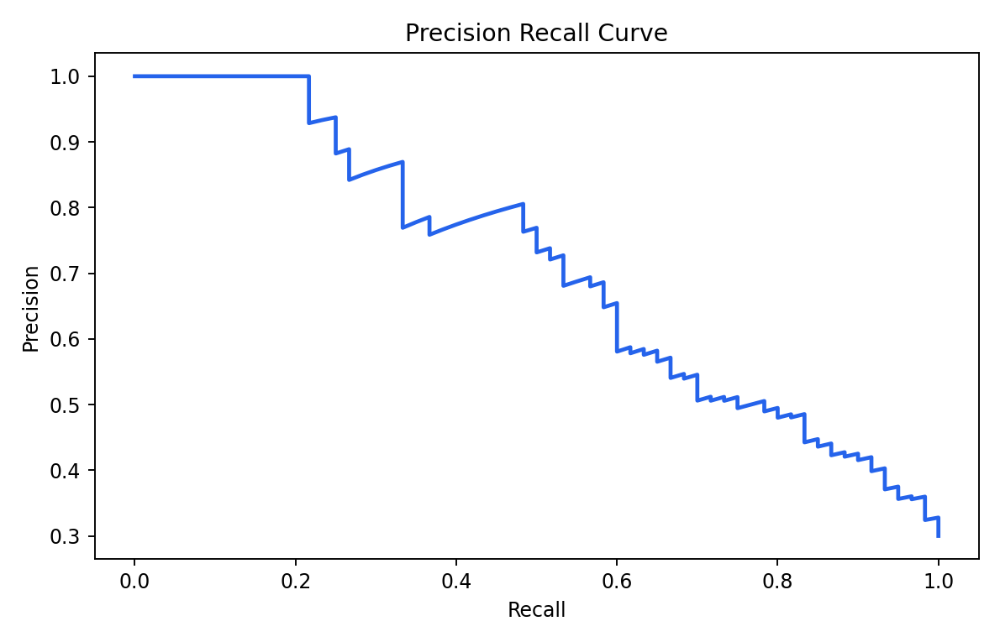
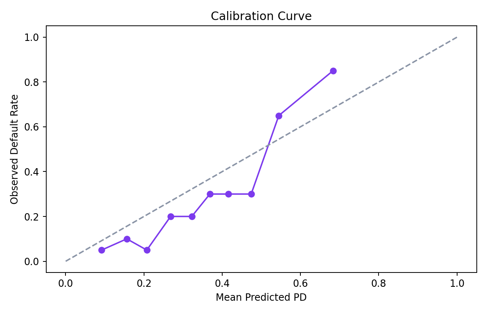
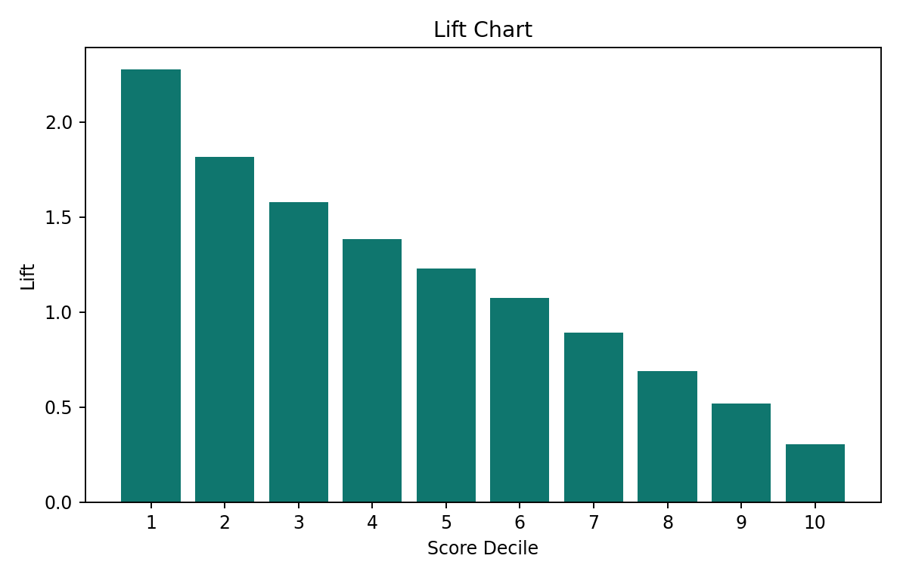
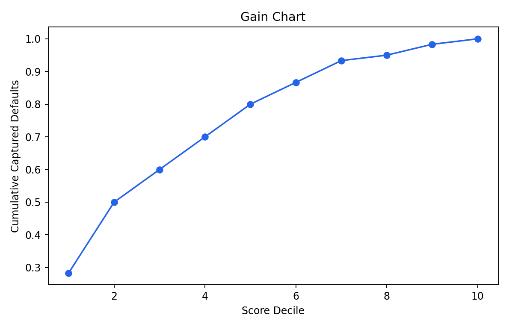
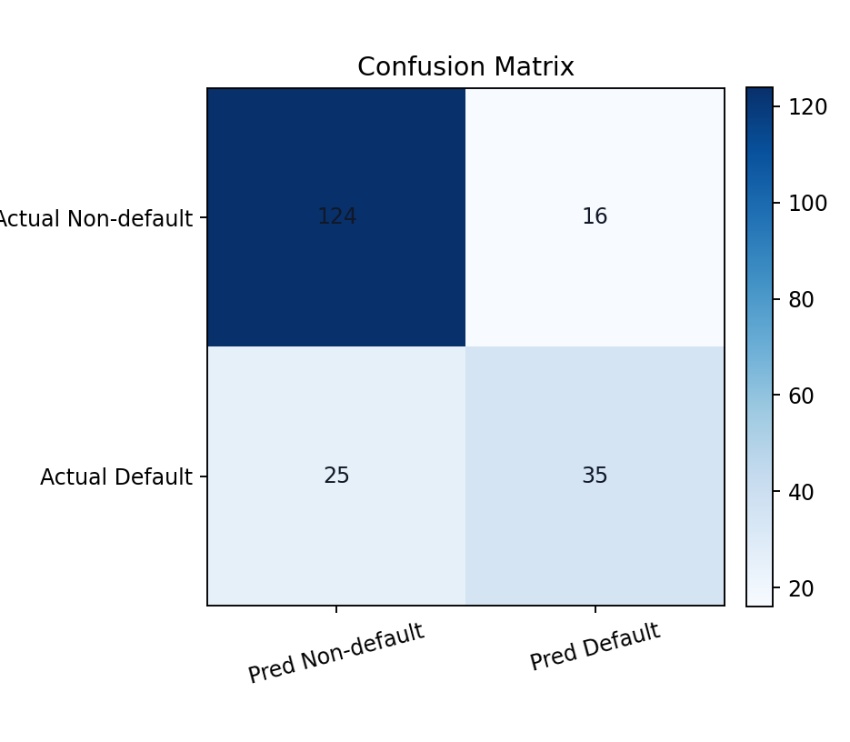
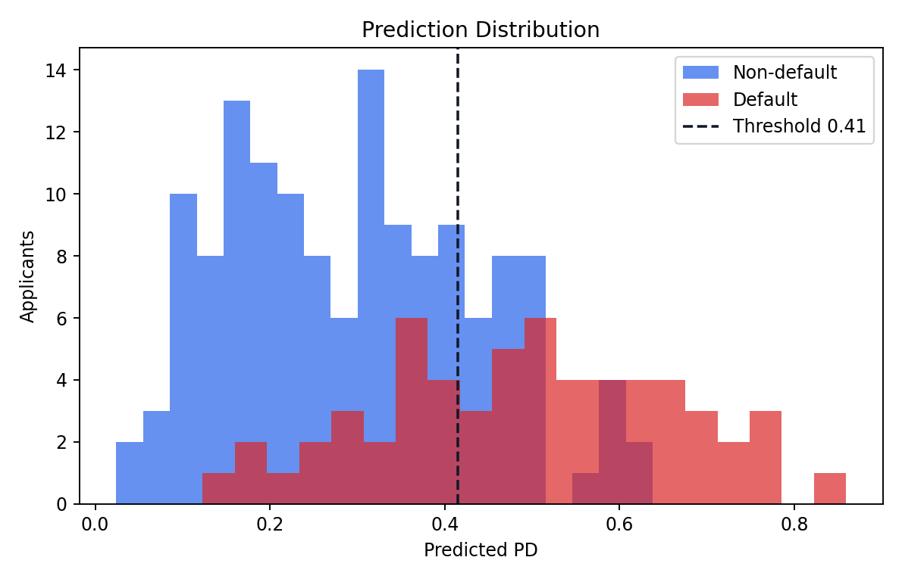
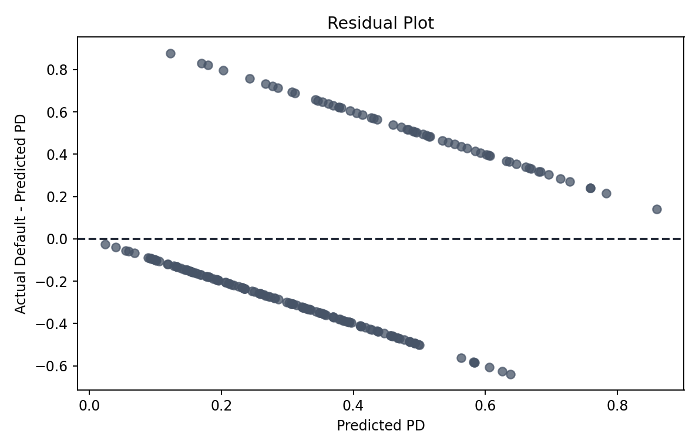
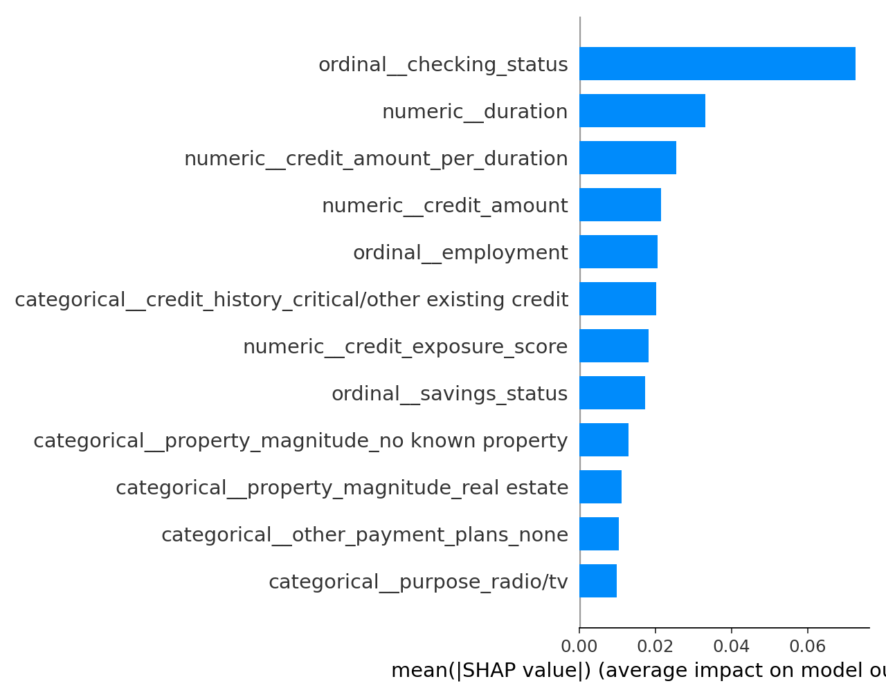

## Methodology and Statistical Soundness

I went back through this pipeline specifically looking for places where the held-out test set
might be influencing a decision it shouldn't. Two real problems turned up, and both were quietly
inflating the reported numbers.

**The decision threshold was being tuned on the test set.** The metrics function was picking the
F1-optimal cutoff using whatever labels it was handed — and when scoring the test set, that meant
precision, recall, F1, and the confusion matrix were all measured at a threshold chosen with
knowledge of the test outcomes. That's not something you could actually do in production. I fixed
it so the threshold is learned from out-of-fold predictions on the training data instead, then
applied as-is to the test set. F1 dropped a little across every model once this was corrected —
which is exactly the amount of optimism that was there before. ROC AUC, PR AUC, KS, and Gini don't
depend on a threshold at all, so none of them moved.

**The champion model was being picked using the test set.** The CLI's default selection metric
was plain test-set ROC AUC, so the "winner" among four candidates was chosen using the same data
later reported as the held-out result — a textbook way to bias your own evaluation. The default
now selects on `cv_roc_auc_mean`, a cross-validated, train-only number (the Streamlit app was
already doing this correctly via `cv_test_mse`). After the fix, the champion is still
`random_forest` — it genuinely wins on cross-validated performance too, so the original conclusion
held up, but I wanted to know that for certain rather than assume it.

Beyond those two fixes, here's what the pipeline gets right by design:

- **All preprocessing is fit inside cross-validation.** Feature engineering, median imputation,
  outlier clipping using train-quantile bounds, scaling, and one-hot/ordinal encoding all live
  inside a single sklearn `Pipeline` — the same estimator handed to `RandomizedSearchCV` — so
  every transform gets re-fit on each fold's training portion only. No statistic ever leaks in
  from a validation fold or the test set. And no engineered feature touches the target, so there's
  no target leakage either.
- **Metric formulas are standard**, nothing custom or reinterpreted: Gini `= 2·AUC − 1`, KS `=
  max(TPR − FPR)` off the ROC curve, PR AUC via average precision, and the cross-validated "test
  MSE" is the Brier score (`mean((y − p)²)` for binary, the multi-class sum-of-squared-errors
  version for 3+ classes).

### Known limitations (honest, not defects)

These are trade-offs I made consciously, not things I missed:

- **Single train/test split.** The test metrics are one 80/20 point estimate with no confidence
  interval, and on a dataset this small (German Credit is 1,000 rows), that estimate carries real
  variance. Repeated splits or a nested-CV outer loop would put a number on it.
- **Non-nested CV for the reported CV scores.** The hyperparameter search and the `cv_*` scores
  reuse the same folds, so those numbers run a little optimistic as generalization estimates.
  They're still fine for *choosing between* candidates, since the bias is roughly uniform across
  models — the untouched test set is the honest headline number.
- **Predicted probabilities may not be perfectly calibrated.** Tree ensembles like random forest
  and XGBoost don't guarantee calibrated `predict_proba` output. I show the calibration curve so
  you can judge for yourself, but I haven't applied any post-hoc calibration like isotonic or
  Platt scaling.
- **Class imbalance handling isn't fully symmetric across models.** Logistic regression and random
  forest tune `class_weight`; XGBoost doesn't tune `scale_pos_weight`, so imbalance gets handled
  slightly differently depending on the model.
- **Ratio features clamp their denominator to a minimum of 1** to avoid dividing by zero, which
  can distort a ratio whose natural denominator legitimately sits below 1.
- **The already-`0`/`1` target direction is assumed** (`1 = default`) — see "How the Target Column
  Is Interpreted" above for the full explanation and the risk that comes with it.

## Testing and Quality

```bash
pytest
ruff check credit_risk_platform tests scripts app.py
black --check credit_risk_platform tests scripts app.py
```

GitHub Actions runs pytest, Ruff, and Black on every push.

## Governance

See [docs/model_governance.md](docs/model_governance.md) for model assumptions, limitations,
potential bias, validation methodology, monitoring strategy, and retraining recommendations.

## Future Roadmap

- Add population stability index and drift monitors for a re-uploaded dataset.
- Add adverse action reason-code reporting alongside each decision.
- Add fairness testing by protected-class proxies where legally and ethically appropriate.
- Support regression targets, not just binary/multi-class classification.
- Let the user override auto-detected column types before training.
- Ask which value means "default" even when a binary target is already `0`/`1`, instead of
  assuming `1 = default` (see "How the Target Column Is Interpreted" above).
